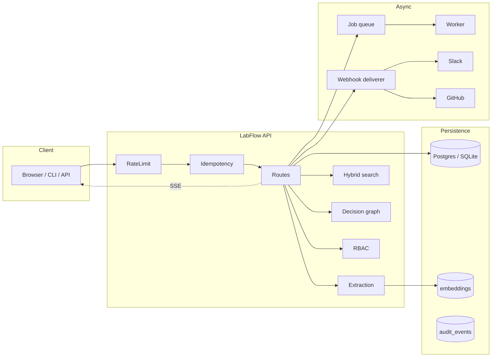

<div align="center">

# 🧪 LabFlow

**The meeting → execution operating system for research and technical teams.**

[](#testing)
[](pyproject.toml)
[](LICENSE)
[](CHANGELOG.md)
[](https://fastapi.tiangolo.com)
[](docs/)

LabFlow turns transcripts, calls, and planning docs into a **typed, queryable
graph** of decisions, action items, experiments, owners, deadlines, and
evidence of completion — with an audit log, webhooks, and live search.
Built for ML research groups, AI/biotech labs, and prototype-heavy startup
teams. Not another notes app.

[Quickstart](#quickstart) · [Architecture](#architecture) · [Feature matrix](#feature-matrix) · [Documentation](docs/) · [Changelog](CHANGELOG.md)

</div>

---

## Why LabFlow

Most meeting assistants stop at a Markdown summary. **LabFlow ships an
execution structure plus verification layer on top:**

* **Typed extraction** — decisions, tasks, experiments, assumptions, and
  blockers are separate first-class entities, each with confidence and a
  source span back to the transcript.
* **Decision graph** — the same statement across two meetings creates a
  supersession edge automatically; the team gets a long-lived
  decision-history they can query and render as a Mermaid diagram.
* **Evidence-driven completion** — tasks are closed by attaching commits,
  PRs, datasets, or artifacts. A built-in verifier scores the match;
  inbound GitHub webhooks attach evidence on their own.
* **Hybrid search** — keyword TF + cosine similarity over stored
  embeddings + recency, with explainable per-result `score_components`.
* **Live everything** — Server-Sent Events stream finalize/close/verify
  events to the dashboard in real time.

## Architecture



Single-process by default (FastAPI + SQLAlchemy + Alembic + an
in-process job worker). Scale horizontally by pointing at Postgres and
running multiple replicas behind any HTTP load balancer.

## Quickstart

### Local (SQLite)

```bash
git clone https://github.com/mariam-oss-eng/labflow.git
cd labflow
python -m venv .venv && source .venv/bin/activate
pip install -e ".[dev]"
alembic upgrade head
labflow serve  # → http://localhost:8000/app
```

Open the dashboard, paste a transcript, hit **Extract →**.

### Docker

```bash
docker compose up --build
```

Boots the API + a worker against a Postgres container.

### One-shot CLI

```bash
echo "@alice will retrain the model. We decided to adopt SentencePiece." \
  | labflow ingest --title "Standup"
labflow digest --weekly
```

## Feature matrix

| Capability | v0.1 | v0.2 | v0.3 | **v0.4** | **v0.5** |
| --- | :-: | :-: | :-: | :-: | :-: |
| Typed extraction (decisions / tasks / experiments) | ✅ | ✅ | ✅ | ✅ | ✅ |
| Multi-tenancy + API keys | — | ✅ | ✅ | ✅ | ✅ |
| Postgres + Alembic migrations | — | ✅ | ✅ | ✅ | ✅ |
| Background job queue + worker | — | — | ✅ | ✅ | ✅ |
| Append-only audit log | — | — | ✅ | ✅ | ✅ |
| Outbound webhooks (HMAC-signed) | — | — | ✅ | ✅ | ✅ |
| Inbound GitHub evidence webhook | — | — | ✅ | ✅ | ✅ |
| Prometheus metrics | — | — | ✅ | ✅ | ✅ |
| Pluggable embeddings | — | — | — | ✅ | ✅ |
| **Hybrid keyword + semantic search** | — | — | — | ✅ | ✅ |
| Decision graph + Mermaid renderer | — | — | — | ✅ | ✅ |
| Per-team rate limiting | — | — | — | ✅ | ✅ |
| Idempotency-Key on writes | — | — | — | ✅ | ✅ |
| Slack notifier | — | — | — | ✅ | ✅ |
| **Role-based access control** | — | — | — | — | ✅ |
| Encryption at rest (Fernet) | — | — | — | — | ✅ |
| Server-Sent Events live stream | — | — | — | — | ✅ |
| Plugin loader (entry-point + dotted) | — | — | — | — | ✅ |
| GDPR export / erase + retention sweep | — | — | — | — | ✅ |

## Configuration

Every setting reads from environment variables (12-factor):

| Variable | Default | Notes |
| --- | --- | --- |
| `LABFLOW_DATABASE_URL` | `sqlite:///./labflow.db` | Postgres URL recommended in prod |
| `LABFLOW_AUTH_ENABLED` | `false` | Multi-tenant API-key auth |
| `LABFLOW_RATE_LIMIT_PER_MINUTE` | `600` | `0` disables |
| `LABFLOW_RATE_LIMIT_BURST` | `60` | Token bucket capacity |
| `LABFLOW_IDEMPOTENCY_TTL_SECONDS` | `86400` | Cache window for `Idempotency-Key` |
| `LABFLOW_EMBEDDING_DIM` | `256` | Hash embedder dimensionality |
| `LABFLOW_EMBEDDING_CALLABLE` | _(unset)_ | `pkg.mod:fn` for real embeddings |
| `LABFLOW_SEARCH_ALPHA` | `0.5` | Hybrid blend (0=lex, 1=semantic) |
| `LABFLOW_DATA_KEY` | _(unset)_ | Fernet key — enables encryption at rest |
| `LABFLOW_PLUGINS` | _(unset)_ | Comma-separated `pkg.mod:obj` plugin specs |
| `LABFLOW_WEBHOOK_SIGNING_SECRET` | _(generated)_ | HMAC-SHA256 secret for outbound hooks |

## API highlights

| Method | Path | Description |
| :-- | --- | --- |
| `POST` | `/api/meetings` | Create + auto-extract a meeting (supports `Idempotency-Key`) |
| `POST` | `/api/meetings/{id}/finalize` | Lock a meeting; emits `meeting.finalized` |
| `POST` | `/api/meetings/{id}/extract:async` | Enqueue extraction, returns `202` + job id |
| `GET`  | `/api/search?q=&alpha=` | Hybrid search w/ explainable score components |
| `GET`  | `/api/graph/decisions` | Decision graph nodes/edges as JSON |
| `GET`  | `/api/graph/decisions.mermaid` | Same graph as Mermaid `flowchart` |
| `GET`  | `/api/stream` | Server-Sent Events stream for the team |
| `GET`  | `/api/me` | Caller's identity, role, and posture |
| `GET`  | `/api/admin/export` | GDPR Article 15 export of every team row |
| `DELETE` | `/api/admin/erase` | GDPR Article 17 hard-delete (admin only) |
| `GET`  | `/healthz`, `/readyz`, `/metrics` | Liveness, readiness, Prometheus |

Full schema: visit `/docs` (Swagger UI) or `/openapi.json`.

## Testing

```bash
pytest          # 128 tests, ~6s on a laptop
pytest -k v04   # subset
```

We run model logic, API contract, RBAC, encryption round-trip, idempotency
replay, rate-limit headers, hybrid search ranking, decision graph rendering,
plugin loading, retention sweep, and Slack payload tests.

## Documentation

The full documentation site is built with [MkDocs Material](docs/mkdocs.yml)
and published to GitHub Pages on every push to `main`.

* [Operations runbook](docs/operations.md)
* [Onboarding guide](docs/onboarding.md)
* [Product spec](docs/product_spec.md)
* [Architecture decision records](docs/adr/)
* [Contributing](CONTRIBUTING.md)

## License

MIT — see [LICENSE](LICENSE).
