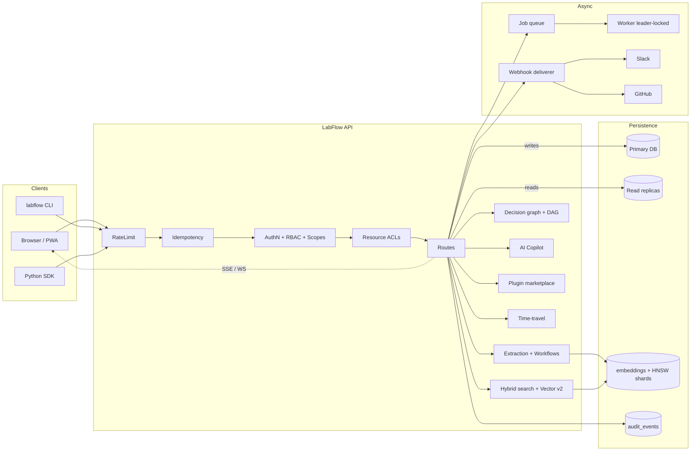

<div align="center">

# 🧪 LabFlow

**The meeting → execution operating system for research and technical teams.**

[](#testing)
[](pyproject.toml)
[](LICENSE)
[](CHANGELOG.md)
[](https://fastapi.tiangolo.com)
[](docs/graphql.md)
[](docs/realtime.md)
[](docs/copilot.md)
[](docs/plugins.md)
[](docs/pwa.md)
[](docs/i18n.md)
[](labflow_client/)
[](docs/observability.md)
[](docs/)

LabFlow turns transcripts, calls, and planning docs into a **typed, queryable
graph** of decisions, action items, experiments, owners, deadlines, and
evidence of completion — with workflows, sprints, an AI Copilot,
plugin marketplace, persistent vector index, time-travel queries,
read-replica routing, an installable PWA, and a fully-localised UI.

Built for ML research groups, AI/biotech labs, and prototype-heavy startup
teams. Not another notes app.

[Quickstart](#quickstart) · [Architecture](#architecture) · [What's new in 0.9](#whats-new-in-09) · [Feature matrix](#feature-matrix) · [Documentation](docs/) · [Changelog](CHANGELOG.md) · [Python SDK](labflow_client/)

</div>

---

## What's new in 0.9

LabFlow 0.9 is the **AI + extensibility** release. The headline:

| Area | What it does |
|---|---|
| 🤖 **AI Copilot** | Multi-step tool-using agent over team data. Ships with a deterministic offline planner *and* a clean LLM hook (`LABFLOW_COPILOT_LLM_CALLABLE`). Every turn is auditable. — [`/api/copilot`](docs/copilot.md) |
| 🧩 **Plugin marketplace** | Catalogue + install/enable/disable lifecycle for signed manifests (SHA-256 verified, scope-permissioned). — [`/api/plugins`](docs/plugins.md) |
| ⚡ **Vector index v2** | Pure-Python HNSW-style on-disk shards, snapshot rotation, brute-force fallback, optional cross-encoder re-rank. Zero new deps. — [`/api/vector`](docs/vector.md) |
| 🌍 **Read-replica routing** | `read_session()` / `write_session()` context managers; round-robin across `LABFLOW_READ_REPLICA_URLS`. — [`/readyz/replicas`](docs/multi-region.md) |
| ⏳ **Time-travel queries** | `?as_of=ISO` views of meetings/tasks reconstructed from `audit_events`. — [`/api/timetravel`](docs/timetravel.md) |
| 📱 **Installable PWA** | Manifest + service worker + offline shell. Add-to-home-screen on iOS/Android/desktop. — [`/static/manifest.webmanifest`](docs/pwa.md) |
| 🗣️ **i18n (en · es · fr)** | RFC 7231 `Accept-Language` negotiation, dict-based catalogue, ready for any new locale by single PR. — [`/api/i18n`](docs/i18n.md) |

And v0.8 (just before it) added: **configurable workflows / state machines**,
**sprints + burndown**, **task DAG + critical path**, **resource ACLs**,
**signed share links**, **API-key scopes**, **CSV exports**, and a
**Slack-compatible notifier**.

200 tests, all green. Zero new runtime dependencies in either release.

---

## Why LabFlow

Most meeting assistants stop at a Markdown summary. **LabFlow ships an
execution structure plus a verification, collaboration, and analytics layer
on top:**

* **Typed extraction** — decisions, tasks, experiments, assumptions, and
  blockers are separate first-class entities, each with confidence and a
  source span back to the transcript.
* **Decision graph** — the same statement across two meetings creates a
  supersession edge automatically; the team gets a long-lived
  decision-history they can query and render as a Mermaid diagram.
* **Evidence-driven completion** — tasks are closed by attaching commits,
  PRs, datasets, or artifacts. A built-in verifier scores the match;
  inbound GitHub webhooks attach evidence on their own.
* **Hybrid search** — keyword TF + cosine similarity over stored
  embeddings + recency, with explainable per-result `score_components`.
  Auto-upgrades to PostgreSQL `to_tsvector` when on Postgres.
* **Live everything** — Server-Sent Events *and* WebSockets stream
  finalize / close / verify / comment / react events to the dashboard.
* **Collaboration** — threaded comments and emoji reactions on every
  decision and task; saved searches; HTML email digests; per-user
  notification preferences.
* **Insights, not dashboards** — a single `/api/analytics` endpoint
  returns cycle-time p50/p90, throughput, completion rate, blocker rate,
  top owners, and an 8-week trend.
* **Power-user surfaces** — read-only **GraphQL** at `/graphql`,
  iCalendar feed at `/api/calendar.ics`, and a typed **Python SDK**.
* **Production-grade** — RBAC, encryption at rest, OpenTelemetry traces,
  Helm chart, distributed worker leader-lock for HA replicas.

## Architecture



Single-process by default (FastAPI + SQLAlchemy + Alembic + an in-process
job worker). Scale horizontally by pointing at Postgres, running multiple
replicas behind any HTTP load balancer, and (optionally) configuring
`LABFLOW_READ_REPLICA_URLS` for read-side fan-out.

## Quickstart

### Local (SQLite)

```bash
git clone https://github.com/mariam-oss-eng/labflow.git
cd labflow
python -m venv .venv && source .venv/bin/activate
pip install -e ".[dev]"
alembic upgrade head
labflow serve  # → http://localhost:8000/app
```

Open the dashboard, paste a transcript, hit **Extract →**.

### Docker

```bash
docker compose up --build
```

Boots the API + a worker against a Postgres container.

### One-shot CLI

```bash
echo "@alice will retrain the model. We decided to adopt SentencePiece." \
  | labflow ingest --title "Standup"
labflow digest --weekly
```

## Feature matrix

| Capability | v0.1–0.5 | v0.6 | v0.7 | **v0.8** | **v0.9** |
| --- | :-: | :-: | :-: | :-: | :-: |
| Typed extraction (decisions / tasks / experiments) | ✅ | ✅ | ✅ | ✅ | ✅ |
| Multi-tenancy + API keys + RBAC | ✅ | ✅ | ✅ | ✅ | ✅ |
| Postgres + Alembic migrations | ✅ | ✅ | ✅ | ✅ | ✅ |
| Background job queue + worker | ✅ | ✅ | ✅ | ✅ | ✅ |
| Append-only audit log | ✅ | ✅ | ✅ | ✅ | ✅ |
| Outbound webhooks (HMAC) + GitHub inbound | ✅ | ✅ | ✅ | ✅ | ✅ |
| Hybrid keyword + semantic search | ✅ | ✅ | ✅ | ✅ | ✅ |
| Decision graph + Mermaid render | ✅ | ✅ | ✅ | ✅ | ✅ |
| Encryption at rest + GDPR export/erase | ✅ | ✅ | ✅ | ✅ | ✅ |
| Plugin loader (entry-point + dotted) | ✅ | ✅ | ✅ | ✅ | ✅ |
| Comments + reactions + analytics + .ics + summaries | — | ✅ | ✅ | ✅ | ✅ |
| AI summary + email digest + notification prefs | — | ✅ | ✅ | ✅ | ✅ |
| WebSocket + GraphQL + OpenTelemetry + Postgres FTS | — | — | ✅ | ✅ | ✅ |
| Distributed worker leader-lock + Python SDK + Helm | — | — | ✅ | ✅ | ✅ |
| **Workflows / state machines + SLA breach sweep** | — | — | — | ✅ | ✅ |
| **Sprints / iterations + burndown** | — | — | — | ✅ | ✅ |
| **Task DAG + critical-path analytics** | — | — | — | ✅ | ✅ |
| **Resource ACLs (per-row allow-list)** | — | — | — | ✅ | ✅ |
| **Signed share links (TTL + passcode)** | — | — | — | ✅ | ✅ |
| **API-key scopes (OAuth-style)** | — | — | — | ✅ | ✅ |
| **CSV exports (RFC 4180 + Excel BOM)** | — | — | — | ✅ | ✅ |
| **Slack-compatible notifier** | — | — | — | ✅ | ✅ |
| **AI Copilot (multi-step tool agent)** | — | — | — | — | ✅ |
| **Plugin marketplace (signed manifests)** | — | — | — | — | ✅ |
| **Vector index v2 (HNSW + re-rank + persist)** | — | — | — | — | ✅ |
| **Read-replica routing** | — | — | — | — | ✅ |
| **Time-travel queries (`?as_of=ISO`)** | — | — | — | — | ✅ |
| **Installable PWA (manifest + SW + offline)** | — | — | — | — | ✅ |
| **i18n (en · es · fr) with `Accept-Language`** | — | — | — | — | ✅ |

## Configuration

Every setting reads from environment variables (12-factor):

| Variable | Default | Notes |
| --- | --- | --- |
| `LABFLOW_DATABASE_URL` | `sqlite:///./labflow.db` | Postgres URL recommended in prod |
| `LABFLOW_AUTH_ENABLED` | `false` | Multi-tenant API-key auth |
| `LABFLOW_RATE_LIMIT_PER_MINUTE` | `600` | `0` disables |
| `LABFLOW_RATE_LIMIT_BURST` | `60` | Token bucket capacity |
| `LABFLOW_IDEMPOTENCY_TTL_SECONDS` | `86400` | Cache window for `Idempotency-Key` |
| `LABFLOW_EMBEDDING_DIM` | `256` | Hash embedder dimensionality |
| `LABFLOW_EMBEDDING_CALLABLE` | _(unset)_ | `pkg.mod:fn` for real embeddings |
| `LABFLOW_SEARCH_ALPHA` | `0.5` | Hybrid blend (0=lex, 1=semantic) |
| `LABFLOW_DATA_KEY` | _(unset)_ | Fernet key — enables encryption at rest |
| `LABFLOW_PLUGINS` | _(unset)_ | Comma-separated `pkg.mod:obj` plugin specs |
| `LABFLOW_WEBHOOK_SIGNING_SECRET` | _(generated)_ | HMAC-SHA256 secret for outbound hooks |
| `LABFLOW_SUMMARY_CALLABLE` | _(unset)_ | `pkg.mod:fn` for an LLM-backed summarizer |
| `LABFLOW_OTEL_ENABLED` | `false` | Auto-instrument with OpenTelemetry when set |

## API highlights

| Method | Path | Description |
| :-- | --- | --- |
| `POST` | `/api/meetings` | Create + auto-extract a meeting (supports `Idempotency-Key`) |
| `POST` | `/api/meetings/{id}/finalize` | Lock a meeting; emits `meeting.finalized` |
| `GET`  | `/api/meetings/{id}/summary` | TextRank or LLM-backed summary _(v0.6)_ |
| `GET`  | `/api/search?q=&alpha=` | Hybrid search w/ explainable score components |
| `GET`  | `/api/graph/decisions` | Decision graph nodes/edges as JSON |
| `GET`  | `/api/analytics?days=30` | Cycle time, throughput, weekly trend _(v0.6)_ |
| `GET`  | `/api/calendar.ics` | iCalendar feed of upcoming due dates _(v0.6)_ |
| `GET`/`POST` | `/api/comments` | Threaded comments _(v0.6)_ |
| `POST` | `/api/reactions` | Toggle emoji reactions _(v0.6)_ |
| `GET`/`POST`/`DELETE` | `/api/saved-searches` | Pinnable named queries _(v0.6)_ |
| `GET`  | `/api/digest/weekly.html` | HTML email digest _(v0.6)_ |
| `GET`  | `/api/stream` | Server-Sent Events stream for the team |
| `WS`   | `/ws` | **Bidirectional** realtime channel _(v0.7)_ |
| `POST` | `/graphql` | Read-only GraphQL endpoint _(v0.7)_ |
| `GET`  | `/api/me` | Caller's identity, role, and posture |
| `GET`  | `/api/admin/export` | GDPR Article 15 export of every team row |
| `DELETE` | `/api/admin/erase` | GDPR Article 17 hard-delete (admin only) |
| `GET`  | `/healthz`, `/readyz`, `/metrics` | Liveness, readiness, Prometheus |

Full schema: visit `/docs` (Swagger UI), `/openapi.json`, or `/graphql/schema`.

## Python SDK

```python
from labflow_client import LabFlow

lf = LabFlow("https://labflow.example.com", api_key="lfk_...")
m = lf.create_meeting(title="Standup", transcript=open("notes.md").read())
print(lf.summarize_meeting(m["id"])["summary"])
for t in lf.list_tasks(status="open")["items"]:
    print(t["title"], "→", t["due_date"])
print(lf.analytics(days=14)["cycle_time_p50_days"])
```

The SDK ships sync + async clients, uses `httpx` when installed and falls
back to the stdlib `urllib` so it works in any environment.

## GraphQL

```graphql
query {
  team { slug }
  tasks(status: "open", limit: 10) { id title owner due_date }
  analytics(days: 30) { tasks_closed cycle_time_p50_days }
}
```

`POST /graphql` with `{"query": "..."}`. Selection sets, args, and
`__schema` introspection are all supported. See [docs/graphql.md](docs/graphql.md).

## Realtime (WebSocket)

```javascript
const ws = new WebSocket("wss://labflow.example.com/ws?token=lfk_...");
ws.onmessage = (m) => console.log(JSON.parse(m.data));
ws.send(JSON.stringify({type: "subscribe", events: ["task.closed"]}));
```

See [docs/realtime.md](docs/realtime.md) for filter syntax and the
event catalog.

## Deployment

* `docker compose up --build` — full stack on Docker for local Postgres.
* `helm install labflow deploy/helm/labflow` — production HA on Kubernetes
  (multiple API replicas, leader-elected worker, OTEL collector hooks).
* Bare metal: `pip install labflow && uvicorn labflow.main:create_app
  --factory --workers 4 --proxy-headers`.

## Testing

```bash
pytest          # 154 tests, ~11s on a laptop
pytest -k v06   # subset
```

Coverage spans model logic, API contract, RBAC, encryption round-trip,
idempotency replay, rate-limit headers, hybrid search ranking, decision
graph rendering, plugin loading, retention sweep, Slack payload,
collaboration (comments/reactions/saved-searches), iCalendar feed,
TextRank summary, GraphQL query/introspection/error reporting, WebSocket
hello/subscribe/ping, distributed worker lock acquire/heartbeat/steal,
and the Python SDK against an in-memory app.

## Documentation

The full documentation site is built with [MkDocs Material](docs/mkdocs.yml)
and published to GitHub Pages on every push to `main`.

* [Operations runbook](docs/operations.md)
* [Onboarding guide](docs/onboarding.md)
* [Product spec](docs/product_spec.md)
* [Architecture decision records](docs/adr/)
* [Contributing](CONTRIBUTING.md)

## License

MIT — see [LICENSE](LICENSE).
