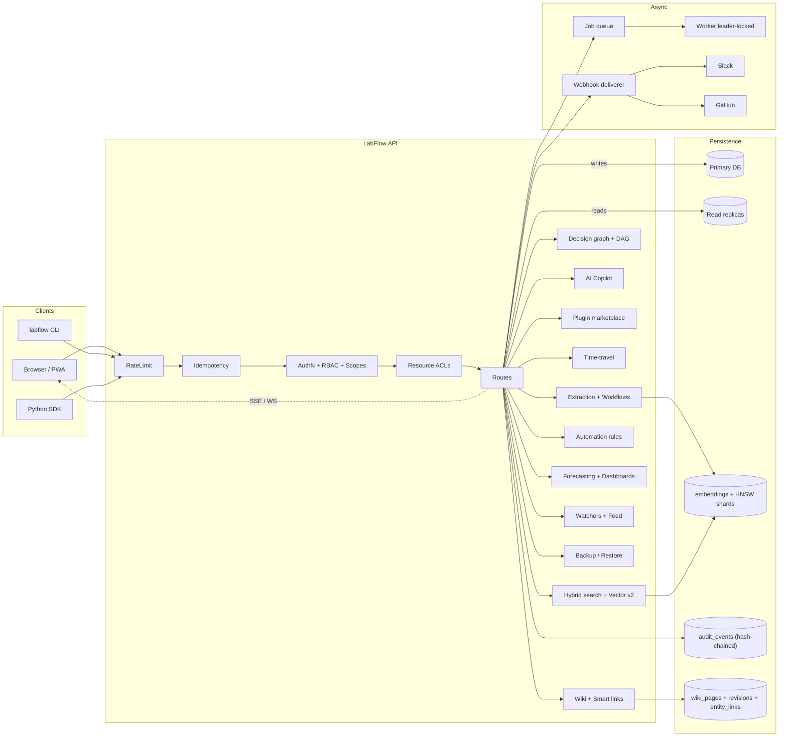

<div align="center">

# 🧪 LabFlow

**The meeting → execution operating system for research and technical teams.**

[](#testing)
[](pyproject.toml)
[](LICENSE)
[](CHANGELOG.md)
[](https://fastapi.tiangolo.com)
[](docs/graphql.md)
[](docs/htmx_and_sdk.md)
[](docs/feature_flags_and_mcp.md)
[](docs/time_tracking.md)
[](docs/feature_flags_and_mcp.md)
[](docs/public_shares.md)
[](docs/htmx_and_sdk.md)
[](docs/boards.md)
[](docs/recurring_and_quotas.md)
[](docs/recurring_and_quotas.md)
[](docs/invites_and_bundle.md)
[](docs/repl.md)
[](docs/audit_chain.md)
[](docs/automation.md)
[](docs/wiki.md)
[](docs/forecasting_and_dashboards.md)
[](docs/copilot.md)
[](docs/plugins.md)
[](docs/pwa.md)
[](docs/i18n.md)
[](labflow_client/)
[](sdk/typescript/)
[](https://mariam-oss-eng.github.io/labflow/)

LabFlow turns transcripts, calls, and planning docs into a **typed, queryable
graph** of decisions, action items, experiments, owners, deadlines, and
evidence of completion. v0.14–v0.15 add **task time tracking & effort
estimates**, **per-team feature flags**, an **MCP-style JSON-RPC tool
endpoint** for external LLM agents, **smart-list change subscriptions**, an
**HTMX-powered task list page** with inline transitions, **public time-bound
share links**, and an **OpenAPI → stdlib Python client generator**
(`labflow gen-sdk`) — on top of the v0.12–v0.13 foundation (Kanban board,
recurring tasks, per-key quotas, federated guest invites, smart lists,
Markdown bundle export, interactive CLI REPL).

Built for ML research groups, AI/biotech labs, and prototype-heavy startup
teams. Not another notes app.

[Quickstart](#quickstart) · [Architecture](#architecture) · [What's new in 0.15](#whats-new-in-015) · [What's new in 0.14](#whats-new-in-014) · [Feature matrix](#feature-matrix) · [Documentation](https://mariam-oss-eng.github.io/labflow/) · [Changelog](CHANGELOG.md) · [Python SDK](labflow_client/) · [TypeScript SDK](sdk/typescript/)

</div>

---

## What's new in 0.15

LabFlow 0.15 is the **native UX & ecosystem** release.

| Area | What it does |
|---|---|
| ⚡ **HTMX task list** | `/app/tasks` — server-rendered, no build step. Filter-as-you-type, status filter, inline status transitions via `hx-post` + `outerHTML` swap. `htmx@2` is loaded from a CDN with an SRI hash; nothing else added. — [docs](docs/htmx_and_sdk.md) |
| 🔗 **Public share links** | Mint a time-bound, revocable, **read-only** URL for one decision/task/wiki page. 32-byte token returned to the creator exactly once; persisted as SHA-256. View counter on every resolve. — [docs](docs/public_shares.md) |
| 🛠️ **`labflow gen-sdk`** | Generate a single-file, dependency-free Python client from the OpenAPI spec, locally or `--from-server`. One `Client` class with one method per `operationId`; `urllib` + `json` only. The generated source is asserted to compile in CI. — [docs](docs/htmx_and_sdk.md) |

## What's new in 0.14

LabFlow 0.14 is the **insights & intelligence** release.

| Area | What it does |
|---|---|
| ⏱️ **Time tracking** | Timers (`/start` + `/stop`) and manual entries on the same `time_entries` row. Single-open-timer-per-owner invariant: starting a 2nd timer implicitly stops the first as a separate audit event. Per-task and team aggregates at `/api/tasks/{id}/time` and `/api/time/report`. — [docs](docs/time_tracking.md) |
| 📐 **Effort estimates** | `tasks.effort_hours` column overrides the `dag.py` heuristic so critical-path math uses real numbers. — `PUT /api/tasks/{id}/effort` |
| 🚩 **Feature flags** | Per-team boolean toggles with optional JSON payload, persisted, with a 1-second process cache. Validated key shape (`[a-z0-9._-]{1..80}`). — [`/api/feature-flags`](docs/feature_flags_and_mcp.md) |
| 🤖 **MCP tool endpoint** | `POST /api/mcp` speaks JSON-RPC 2.0 (`tools/list`, `tools/call`) — the same wire format external LLM agents use. Five **read-only** tools: `search`, `list_open_tasks`, `get_task`, `list_decisions`, `analytics`. Mutations stay on the typed REST API. — [docs](docs/feature_flags_and_mcp.md) |
| 📡 **Smart-list subscriptions** | A SHA-256-digest sweeper fires only when a smart list's task IDs change since the last fire. Detection is decoupled from delivery so the caller wires any transport. — `/api/smart-lists/{slug}/subscriptions` |

## What's new in 0.13

LabFlow 0.13 is the **federation, CLI & showcase** release.

| Area | What it does |
|---|---|
| 🤝 **Federated guest invites** | One-time, time-bound tokens minting a fresh API key whose ACL is materialised from the invite scope. Tokens stored as SHA-256 hashes; plaintext returned exactly once. — [`/api/invites`](docs/invites_and_bundle.md) |
| 📜 **Markdown bundle export** | One zip with one `.md` per meeting/decision/task/wiki + `manifest.json` + `audit.jsonl` (full v0.10 hash chain). Pure stdlib `zipfile`. — [`/api/admin/export/bundle.zip`](docs/invites_and_bundle.md) |
| 🔎 **Smart lists** | Slug-addressed declarative task filters — whitelisted keys (`state`, `assignee_handle`, `priority`, `label`, `due_before`, `sprint_slug`) so a typo can never silently match everything. — [`/api/smart-lists`](docs/boards.md#smart-lists-v013) |
| 💻 **Interactive CLI REPL** | `labflow repl` — a stdlib `cmd` shell against your team's database. `tasks` / `task 42 done` / `meetings` / `decisions` / `ingest`. — [`labflow repl`](docs/repl.md) |
| 🌟 **Showcase landing** | `docs/index.md` rewrite: hero pitch, comparison table vs Notion / Jira, "60-second start" snippet, expanded architecture diagram. |

## What's new in 0.12

LabFlow 0.12 is the **boards, schedules & quotas** release.

| Area | What it does |
|---|---|
| 📋 **Kanban board** | JSON at `/api/board/{workflow}`, single-file HTML at `/app/board/{workflow}`. Columns are driven by your workflow's state machine; legacy tasks land in a synthetic `inbox`. — [board docs](docs/boards.md) |
| 🔁 **Recurring tasks** | Daily / weekly / monthly templates that materialise into real `Task` rows. Idempotent sweep advances `next_run_at` *before* commit. Monthly clamps to last day of short months. — [`/api/recurring-tasks`](docs/recurring_and_quotas.md) |
| 🚦 **Per-API-key daily quotas** | Two narrow tables (`api_key_quotas` + `api_key_usage`), opt-in per route, returns `429`. Keys with no row remain unlimited. — [`/api/admin/quotas`](docs/recurring_and_quotas.md#api-key-quotas) |
| 🧮 **Bulk task operations** | Atomic `set_status`, `set_state`, `assign`, `set_priority`, `complete` across many task IDs. Per-task failures isolated and reported. — `POST /api/tasks/bulk` |
| 🕘 **Per-key digest hour** | Pick the UTC hour you want your daily/weekly digest delivered. Sweeper API at `/api/notifications/digest-due?hour=N`. |

## What's new in 0.11

LabFlow 0.11 is the **knowledge & polish** release.

| Area | What it does |
|---|---|
| 📚 **Wiki / knowledge base** | Slug-addressed Markdown pages with **immutable revision history**, soft-delete, and substring search. — [`/api/wiki/pages`](docs/wiki.md) |
| 🔗 **Smart entity links** | `#task-N`, `[[Page]]`, `@handle` are parsed out of every wiki/comment/transcript and materialised in `entity_links`. **Backlinks** in both directions, instantly. — [`/api/links/backlinks`](docs/wiki.md) |
| 🛠 **GraphQL mutations** | `commentCreate`, `taskTransition`, `wikiPageUpsert` on the same hand-rolled engine — same scope/role enforcement as REST. — [`/graphql`](docs/graphql.md) |
| 👀 **Watchers + activity feed** | Per-API-key subscriptions on any entity → aggregated `/api/feed`. Falls back to team-wide audit when the caller has no watches. — [`/api/watchers`](docs/watchers.md) |
| 📦 **TypeScript SDK** | Hand-written, **zero runtime dependencies**, works in Node ≥18 and modern browsers. — [`@labflow/sdk`](sdk/typescript/) |
| 🌐 **Public docs site** | mkdocs-material site auto-published to GitHub Pages on every push to `main`. — [labflow docs](https://mariam-oss-eng.github.io/labflow/) |

## What's new in 0.10

LabFlow 0.10 is the **trust & insights** release.

| Area | What it does |
|---|---|
| 🔐 **Tamper-evident audit chain** | Every `audit_events` row is hash-chained (`prev_hash`/`entry_hash` with SHA-256). One endpoint reports the first row that diverges. — [`/api/audit/verify`](docs/audit_chain.md) |
| 💾 **Signed backup & restore** | Full-team JSON snapshot signed with `HMAC-SHA256(secret, ...)`. Restores into a *new* slug only — never silently overwrites live data. — [`/api/admin/backup`](docs/backup.md) |
| ⚙️ **Automation rules engine** | Declarative when/then JSON rules. Three built-in actions (`tag`, `notify`, `webhook`); dispatched synchronously from the audit layer so the chain stays continuous. — [`/api/automation/rules`](docs/automation.md) |
| 📈 **Forecasting** | Sprint ETA via least-squares on burndown (with ±1σ confidence band) and per-task ETA from owner cycle-time stats. Pure Python. — [`/api/forecast/sprint/{slug}`](docs/forecasting_and_dashboards.md) |
| 📊 **Customisable dashboards** | Per-API-key widget layouts. Five built-in widget kinds; `/api/dashboards/{slug}/data` renders them in one call. — [`/api/dashboards`](docs/forecasting_and_dashboards.md) |

**235 tests, all green. Zero new runtime dependencies in either release.**

---

## Why LabFlow

Most meeting assistants stop at a Markdown summary. **LabFlow ships an
execution structure plus a verification, collaboration, and analytics layer
on top:**

* **Typed extraction** — decisions, tasks, experiments, assumptions, and
  blockers are separate first-class entities, each with confidence and a
  source span back to the transcript.
* **Decision graph** — the same statement across two meetings creates a
  supersession edge automatically; the team gets a long-lived
  decision-history they can query and render as a Mermaid diagram.
* **Evidence-driven completion** — tasks are closed by attaching commits,
  PRs, datasets, or artifacts. A built-in verifier scores the match;
  inbound GitHub webhooks attach evidence on their own.
* **Hybrid search** — keyword TF + cosine similarity over stored
  embeddings + recency, with explainable per-result `score_components`.
  Auto-upgrades to PostgreSQL `to_tsvector` when on Postgres.
* **Live everything** — Server-Sent Events *and* WebSockets stream
  finalize / close / verify / comment / react events to the dashboard.
* **Collaboration** — threaded comments and emoji reactions on every
  decision and task; saved searches; HTML email digests; per-user
  notification preferences.
* **Insights, not dashboards** — a single `/api/analytics` endpoint
  returns cycle-time p50/p90, throughput, completion rate, blocker rate,
  top owners, and an 8-week trend.
* **Power-user surfaces** — read-only **GraphQL** at `/graphql`,
  iCalendar feed at `/api/calendar.ics`, and a typed **Python SDK**.
* **Production-grade** — RBAC, encryption at rest, OpenTelemetry traces,
  Helm chart, distributed worker leader-lock for HA replicas.

## Architecture



Single-process by default (FastAPI + SQLAlchemy + Alembic + an in-process
job worker). Scale horizontally by pointing at Postgres, running multiple
replicas behind any HTTP load balancer, and (optionally) configuring
`LABFLOW_READ_REPLICA_URLS` for read-side fan-out.

## Quickstart

### Local (SQLite)

```bash
git clone https://github.com/mariam-oss-eng/labflow.git
cd labflow
python -m venv .venv && source .venv/bin/activate
pip install -e ".[dev]"
alembic upgrade head
labflow serve  # → http://localhost:8000/app
```

Open the dashboard, paste a transcript, hit **Extract →**.

### Docker

```bash
docker compose up --build
```

Boots the API + a worker against a Postgres container.

### One-shot CLI

```bash
echo "@alice will retrain the model. We decided to adopt SentencePiece." \
  | labflow ingest --title "Standup"
labflow digest --weekly
```

## Feature matrix

| Capability | v0.1–0.5 | v0.6 | v0.7 | v0.8 | v0.9 | v0.10 | v0.11 | v0.12 | v0.13 | **v0.14** | **v0.15** |
| --- | :-: | :-: | :-: | :-: | :-: | :-: | :-: | :-: | :-: | :-: | :-: |
| Typed extraction (decisions / tasks / experiments) | ✅ | ✅ | ✅ | ✅ | ✅ | ✅ | ✅ | ✅ | ✅ | ✅ | ✅ |
| Multi-tenancy + API keys + RBAC | ✅ | ✅ | ✅ | ✅ | ✅ | ✅ | ✅ | ✅ | ✅ | ✅ | ✅ |
| Postgres + Alembic migrations | ✅ | ✅ | ✅ | ✅ | ✅ | ✅ | ✅ | ✅ | ✅ | ✅ | ✅ |
| Background job queue + worker | ✅ | ✅ | ✅ | ✅ | ✅ | ✅ | ✅ | ✅ | ✅ | ✅ | ✅ |
| Append-only audit log | ✅ | ✅ | ✅ | ✅ | ✅ | ✅ | ✅ | ✅ | ✅ | ✅ | ✅ |
| Outbound webhooks (HMAC) + GitHub inbound | ✅ | ✅ | ✅ | ✅ | ✅ | ✅ | ✅ | ✅ | ✅ | ✅ | ✅ |
| Hybrid keyword + semantic search | ✅ | ✅ | ✅ | ✅ | ✅ | ✅ | ✅ | ✅ | ✅ | ✅ | ✅ |
| Decision graph + Mermaid render | ✅ | ✅ | ✅ | ✅ | ✅ | ✅ | ✅ | ✅ | ✅ | ✅ | ✅ |
| Encryption at rest + GDPR export/erase | ✅ | ✅ | ✅ | ✅ | ✅ | ✅ | ✅ | ✅ | ✅ | ✅ | ✅ |
| Plugin loader (entry-point + dotted) | ✅ | ✅ | ✅ | ✅ | ✅ | ✅ | ✅ | ✅ | ✅ | ✅ | ✅ |
| Comments + reactions + analytics + .ics + summaries | — | ✅ | ✅ | ✅ | ✅ | ✅ | ✅ | ✅ | ✅ | ✅ | ✅ |
| AI summary + email digest + notification prefs | — | ✅ | ✅ | ✅ | ✅ | ✅ | ✅ | ✅ | ✅ | ✅ | ✅ |
| WebSocket + GraphQL + OpenTelemetry + Postgres FTS | — | — | ✅ | ✅ | ✅ | ✅ | ✅ | ✅ | ✅ | ✅ | ✅ |
| Distributed worker leader-lock + Python SDK + Helm | — | — | ✅ | ✅ | ✅ | ✅ | ✅ | ✅ | ✅ | ✅ | ✅ |
| Workflows / state machines + SLA breach sweep | — | — | — | ✅ | ✅ | ✅ | ✅ | ✅ | ✅ | ✅ | ✅ |
| Sprints / iterations + burndown | — | — | — | ✅ | ✅ | ✅ | ✅ | ✅ | ✅ | ✅ | ✅ |
| Task DAG + critical-path analytics | — | — | — | ✅ | ✅ | ✅ | ✅ | ✅ | ✅ | ✅ | ✅ |
| Resource ACLs (per-row allow-list) | — | — | — | ✅ | ✅ | ✅ | ✅ | ✅ | ✅ | ✅ | ✅ |
| Signed share links (TTL + passcode) | — | — | — | ✅ | ✅ | ✅ | ✅ | ✅ | ✅ | ✅ | ✅ |
| API-key scopes (OAuth-style) | — | — | — | ✅ | ✅ | ✅ | ✅ | ✅ | ✅ | ✅ | ✅ |
| CSV exports (RFC 4180 + Excel BOM) | — | — | — | ✅ | ✅ | ✅ | ✅ | ✅ | ✅ | ✅ | ✅ |
| Slack-compatible notifier | — | — | — | ✅ | ✅ | ✅ | ✅ | ✅ | ✅ | ✅ | ✅ |
| AI Copilot (multi-step tool agent) | — | — | — | — | ✅ | ✅ | ✅ | ✅ | ✅ | ✅ | ✅ |
| Plugin marketplace (signed manifests) | — | — | — | — | ✅ | ✅ | ✅ | ✅ | ✅ | ✅ | ✅ |
| Vector index v2 (HNSW + re-rank + persist) | — | — | — | — | ✅ | ✅ | ✅ | ✅ | ✅ | ✅ | ✅ |
| Read-replica routing | — | — | — | — | ✅ | ✅ | ✅ | ✅ | ✅ | ✅ | ✅ |
| Time-travel queries (`?as_of=ISO`) | — | — | — | — | ✅ | ✅ | ✅ | ✅ | ✅ | ✅ | ✅ |
| Installable PWA (manifest + SW + offline) | — | — | — | — | ✅ | ✅ | ✅ | ✅ | ✅ | ✅ | ✅ |
| i18n (en · es · fr) with `Accept-Language` | — | — | — | — | ✅ | ✅ | ✅ | ✅ | ✅ | ✅ | ✅ |
| Tamper-evident audit hash chain | — | — | — | — | — | ✅ | ✅ | ✅ | ✅ | ✅ | ✅ |
| Signed full-team backup & restore | — | — | — | — | — | ✅ | ✅ | ✅ | ✅ | ✅ | ✅ |
| Declarative automation rules engine | — | — | — | — | — | ✅ | ✅ | ✅ | ✅ | ✅ | ✅ |
| Sprint forecasting (least-squares ETA) | — | — | — | — | — | ✅ | ✅ | ✅ | ✅ | ✅ | ✅ |
| Customisable dashboards (widget catalogue) | — | — | — | — | — | ✅ | ✅ | ✅ | ✅ | ✅ | ✅ |
| Wiki / knowledge base + revision history | — | — | — | — | — | — | ✅ | ✅ | ✅ | ✅ | ✅ |
| Smart entity links (`#task` / `[[Page]]` / `@handle`) + backlinks | — | — | — | — | — | — | ✅ | ✅ | ✅ | ✅ | ✅ |
| GraphQL mutations | — | — | — | — | — | — | ✅ | ✅ | ✅ | ✅ | ✅ |
| Watchers + activity feed | — | — | — | — | — | — | ✅ | ✅ | ✅ | ✅ | ✅ |
| TypeScript SDK (`@labflow/sdk`, zero deps) | — | — | — | — | — | — | ✅ | ✅ | ✅ | ✅ | ✅ |
| GitHub Pages docs site (mkdocs-material) | — | — | — | — | — | — | ✅ | ✅ | ✅ | ✅ | ✅ |
| Kanban board (JSON + HTML) | — | — | — | — | — | — | — | ✅ | ✅ | ✅ | ✅ |
| Recurring tasks (daily / weekly / monthly) | — | — | — | — | — | — | — | ✅ | ✅ | ✅ | ✅ |
| Per-API-key daily quotas | — | — | — | — | — | — | — | ✅ | ✅ | ✅ | ✅ |
| Bulk task operations | — | — | — | — | — | — | — | ✅ | ✅ | ✅ | ✅ |
| Per-key digest hour scheduling | — | — | — | — | — | — | — | ✅ | ✅ | ✅ | ✅ |
| Federated guest invites (scoped ACLs) | — | — | — | — | — | — | — | — | ✅ | ✅ | ✅ |
| Markdown bundle export (zip) | — | — | — | — | — | — | — | — | ✅ | ✅ | ✅ |
| Smart lists (declarative filters) | — | — | — | — | — | — | — | — | ✅ | ✅ | ✅ |
| Interactive CLI REPL (`labflow repl`) | — | — | — | — | — | — | — | — | ✅ | ✅ | ✅ |
| **Task time tracking (timers + manual)** | — | — | — | — | — | — | — | — | — | ✅ | ✅ |
| **Task effort estimates (`effort_hours`)** | — | — | — | — | — | — | — | — | — | ✅ | ✅ |
| **Per-team feature flags** | — | — | — | — | — | — | — | — | — | ✅ | ✅ |
| **MCP-style JSON-RPC tool endpoint** | — | — | — | — | — | — | — | — | — | ✅ | ✅ |
| **Smart-list change subscriptions** | — | — | — | — | — | — | — | — | — | ✅ | ✅ |
| **HTMX task list (`/app/tasks`)** | — | — | — | — | — | — | — | — | — | — | ✅ |
| **Public read-only share links** | — | — | — | — | — | — | — | — | — | — | ✅ |
| **OpenAPI → stdlib Python SDK generator (`gen-sdk`)** | — | — | — | — | — | — | — | — | — | — | ✅ |

## Configuration

Every setting reads from environment variables (12-factor):

| Variable | Default | Notes |
| --- | --- | --- |
| `LABFLOW_DATABASE_URL` | `sqlite:///./labflow.db` | Postgres URL recommended in prod |
| `LABFLOW_AUTH_ENABLED` | `false` | Multi-tenant API-key auth |
| `LABFLOW_RATE_LIMIT_PER_MINUTE` | `600` | `0` disables |
| `LABFLOW_RATE_LIMIT_BURST` | `60` | Token bucket capacity |
| `LABFLOW_IDEMPOTENCY_TTL_SECONDS` | `86400` | Cache window for `Idempotency-Key` |
| `LABFLOW_EMBEDDING_DIM` | `256` | Hash embedder dimensionality |
| `LABFLOW_EMBEDDING_CALLABLE` | _(unset)_ | `pkg.mod:fn` for real embeddings |
| `LABFLOW_SEARCH_ALPHA` | `0.5` | Hybrid blend (0=lex, 1=semantic) |
| `LABFLOW_DATA_KEY` | _(unset)_ | Fernet key — enables encryption at rest |
| `LABFLOW_PLUGINS` | _(unset)_ | Comma-separated `pkg.mod:obj` plugin specs |
| `LABFLOW_WEBHOOK_SIGNING_SECRET` | _(generated)_ | HMAC-SHA256 secret for outbound hooks |
| `LABFLOW_SUMMARY_CALLABLE` | _(unset)_ | `pkg.mod:fn` for an LLM-backed summarizer |
| `LABFLOW_OTEL_ENABLED` | `false` | Auto-instrument with OpenTelemetry when set |

## API highlights

| Method | Path | Description |
| :-- | --- | --- |
| `POST` | `/api/meetings` | Create + auto-extract a meeting (supports `Idempotency-Key`) |
| `POST` | `/api/meetings/{id}/finalize` | Lock a meeting; emits `meeting.finalized` |
| `GET`  | `/api/meetings/{id}/summary` | TextRank or LLM-backed summary _(v0.6)_ |
| `GET`  | `/api/search?q=&alpha=` | Hybrid search w/ explainable score components |
| `GET`  | `/api/graph/decisions` | Decision graph nodes/edges as JSON |
| `GET`  | `/api/analytics?days=30` | Cycle time, throughput, weekly trend _(v0.6)_ |
| `GET`  | `/api/calendar.ics` | iCalendar feed of upcoming due dates _(v0.6)_ |
| `GET`/`POST` | `/api/comments` | Threaded comments _(v0.6)_ |
| `POST` | `/api/reactions` | Toggle emoji reactions _(v0.6)_ |
| `GET`/`POST`/`DELETE` | `/api/saved-searches` | Pinnable named queries _(v0.6)_ |
| `GET`  | `/api/digest/weekly.html` | HTML email digest _(v0.6)_ |
| `GET`  | `/api/stream` | Server-Sent Events stream for the team |
| `WS`   | `/ws` | **Bidirectional** realtime channel _(v0.7)_ |
| `POST` | `/graphql` | Read-only GraphQL endpoint _(v0.7)_ |
| `GET`  | `/api/audit/verify` | **Walks the hash chain & reports first divergence** _(v0.10)_ |
| `POST` | `/api/admin/backup` | **Signed full-team JSON backup** _(v0.10)_ |
| `POST` | `/api/admin/restore/{preview,apply}` | **Restore into a new team slug** _(v0.10)_ |
| `GET`/`POST`/`DELETE` | `/api/automation/rules` | **Declarative automation rules CRUD** _(v0.10)_ |
| `GET`  | `/api/forecast/sprint/{slug}` | **Sprint completion ETA** _(v0.10)_ |
| `GET`  | `/api/forecast/task/{id}` | **Per-task ETA from cycle-time stats** _(v0.10)_ |
| `GET`/`POST` | `/api/dashboards` | **Customisable widget layouts** _(v0.10)_ |
| `GET`  | `/api/dashboards/{slug}/data` | **Render a dashboard in one call** _(v0.10)_ |
| `GET`/`POST`/`DELETE` | `/api/wiki/pages` | **Markdown wiki + revisions + soft-delete** _(v0.11)_ |
| `GET`  | `/api/wiki/search?q=` | **Wiki substring search** _(v0.11)_ |
| `GET`  | `/api/links/backlinks?target_type=&target_id=` | **Bidirectional smart-link backlinks** _(v0.11)_ |
| `GET`/`POST`/`DELETE` | `/api/watchers` | **Per-API-key entity subscriptions** _(v0.11)_ |
| `GET`  | `/api/feed` | **Aggregated activity feed for the caller** _(v0.11)_ |
| `GET`  | `/api/me` | Caller's identity, role, and posture |
| `GET`  | `/api/admin/export` | GDPR Article 15 export of every team row |
| `DELETE` | `/api/admin/erase` | GDPR Article 17 hard-delete (admin only) |
| `GET`  | `/healthz`, `/readyz`, `/metrics` | Liveness, readiness, Prometheus |

Full schema: visit `/docs` (Swagger UI), `/openapi.json`, or `/graphql/schema`.

## Python SDK

```python
from labflow_client import LabFlow

lf = LabFlow("https://labflow.example.com", api_key="lfk_...")
m = lf.create_meeting(title="Standup", transcript=open("notes.md").read())
print(lf.summarize_meeting(m["id"])["summary"])
for t in lf.list_tasks(status="open")["items"]:
    print(t["title"], "→", t["due_date"])
print(lf.analytics(days=14)["cycle_time_p50_days"])
```

The SDK ships sync + async clients, uses `httpx` when installed and falls
back to the stdlib `urllib` so it works in any environment.

## TypeScript SDK

```ts
import { LabFlowClient } from "@labflow/sdk";

const client = new LabFlowClient({
  baseUrl: "https://labflow.example.com",
  apiKey: process.env.LABFLOW_API_KEY,
});

await client.upsertWikiPage({
  title: "Sprint 3 plan",
  body: "Owner: @alice. See [[Architecture]] and #task-42.",
});
const forecast = await client.forecastSprint("sprint-3");
console.log(`ETA: ${forecast.eta_iso} (±${forecast.confidence_days}d)`);
```

Hand-written, **zero runtime dependencies**, works in Node ≥18 and modern
browsers. See [`sdk/typescript/`](sdk/typescript/).

## GraphQL

```graphql
query {
  team { slug }
  tasks(status: "open", limit: 10) { id title owner due_date }
  analytics(days: 30) { tasks_closed cycle_time_p50_days }
}
```

`POST /graphql` with `{"query": "..."}`. Selection sets, args, and
`__schema` introspection are all supported. See [docs/graphql.md](docs/graphql.md).

## Realtime (WebSocket)

```javascript
const ws = new WebSocket("wss://labflow.example.com/ws?token=lfk_...");
ws.onmessage = (m) => console.log(JSON.parse(m.data));
ws.send(JSON.stringify({type: "subscribe", events: ["task.closed"]}));
```

See [docs/realtime.md](docs/realtime.md) for filter syntax and the
event catalog.

## Deployment

* `docker compose up --build` — full stack on Docker for local Postgres.
* `helm install labflow deploy/helm/labflow` — production HA on Kubernetes
  (multiple API replicas, leader-elected worker, OTEL collector hooks).
* Bare metal: `pip install labflow && uvicorn labflow.main:create_app
  --factory --workers 4 --proxy-headers`.

## Testing

```bash
pytest          # 235 tests, ~30s on a laptop
pytest -k v10   # subset (audit chain, backup, automation, forecast, dashboards)
pytest -k v11   # subset (wiki, smart links, watchers, graphql mutations)
```

Coverage spans model logic, API contract, RBAC, encryption round-trip,
idempotency replay, rate-limit headers, hybrid search ranking, decision
graph rendering, plugin loading, retention sweep, Slack payload,
collaboration (comments/reactions/saved-searches), iCalendar feed,
TextRank summary, GraphQL query/mutation/introspection/error reporting,
WebSocket hello/subscribe/ping, distributed worker lock
acquire/heartbeat/steal, the Python SDK against an in-memory app, the
audit hash-chain verifier (incl. tamper detection), backup signature
round-trip, automation rule firing, sprint + per-task ETA estimators,
dashboard widget rendering, wiki revisions + soft-delete, smart-link
materialisation + backlinks, and watchers/feed.

## Documentation

The full documentation site is built with [MkDocs Material](docs/mkdocs.yml)
and **published live at <https://mariam-oss-eng.github.io/labflow/>** on
every push to `main` via the [`pages.yml`](.github/workflows/pages.yml)
workflow.

* [Operations runbook](docs/operations.md)
* [Onboarding guide](docs/onboarding.md)
* [Product spec](docs/product_spec.md)
* [Architecture decision records](docs/adr/)
* [Contributing](CONTRIBUTING.md)

## License

MIT — see [LICENSE](LICENSE).
