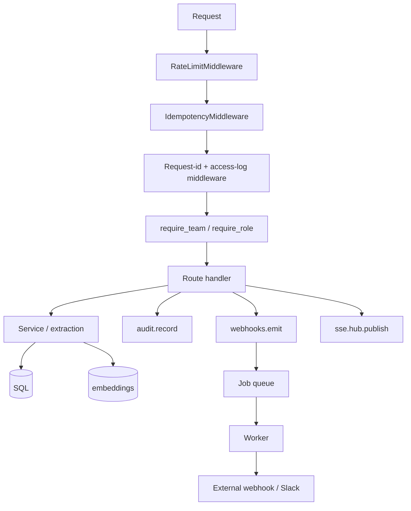
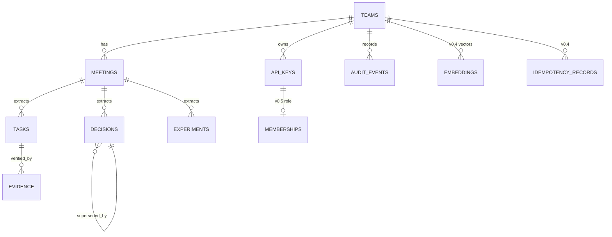

# Architecture

LabFlow is a single Python package (`labflow/`) with five concerns,
each isolated in its own module:

| Concern | Module(s) | Notes |
| --- | --- | --- |
| HTTP surface | `main.py` | FastAPI app factory, route registration |
| Persistence | `db.py`, `models.py`, `migrations/` | SQLAlchemy 2 + Alembic |
| Domain logic | `extraction.py`, `services.py`, `verification.py` | Pure functions; no FastAPI imports |
| Search & graph | `embeddings.py`, `embedding_store.py`, `search.py`, `graph.py` | Hybrid lexical + semantic + recency |
| Cross-cutting | `auth.py`, `ratelimit.py`, `idempotency.py`, `crypto.py`, `audit.py`, `webhooks.py`, `sse.py`, `plugins.py`, `retention.py` | Each is independent |

## Request flow

## Key design decisions

See the ADR index for full motivation:

* **[ADR-0001 · Hybrid search ranking](adr/0001-hybrid-search.md)** —
  why we blend lex/semantic/recency and expose `score_components`.
* **[ADR-0002 · Idempotency as raw ASGI](adr/0002-idempotency-middleware.md)** —
  why `BaseHTTPMiddleware` was the wrong primitive.
* **[ADR-0003 · Encryption at rest with Fernet](adr/0003-encryption-at-rest.md)** —
  why we picked Fernet + `TypeDecorator` and what's *not* encrypted.

## Data model (high level)

