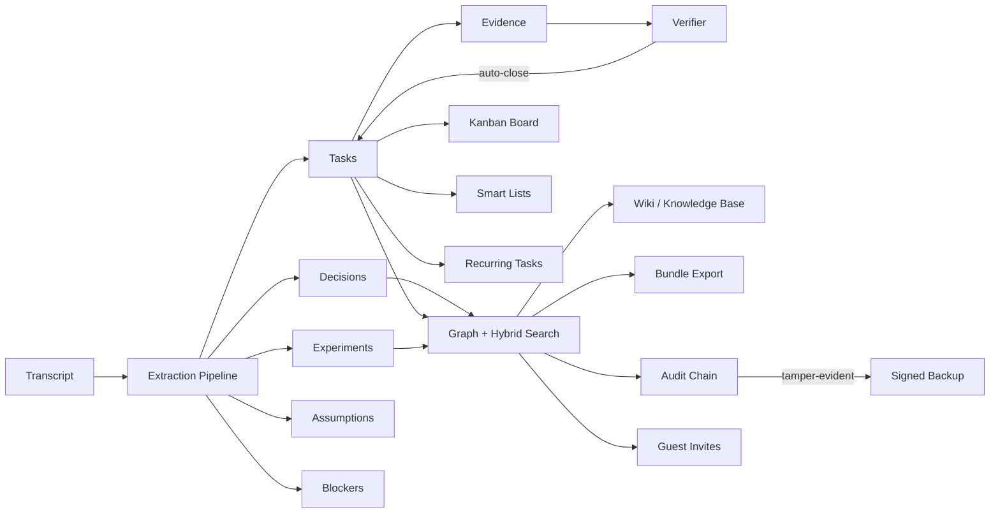

# LabFlow

<p align="center">
  <strong>Turn your team's meetings into shipped work.</strong><br/>
  <em>The open-source meeting-to-execution operating system.</em>
</p>

<p align="center">
  <a href="https://github.com/mariam-oss-eng/labflow"></a>
  <a href="#"></a>
  <a href="#"></a>
  <a href="#"></a>
  <a href="#"></a>
  <a href="#"></a>
</p>

> Paste a transcript. Get a queryable graph of decisions, tasks,
> experiments, and evidence. Stream them onto a Kanban board, share
> them through scoped invites, track your time on each one, expose
> them to LLM agents over MCP, publish a single decision through a
> revocable share link, ship them.

---

## Why LabFlow?

You already write notes after every standup. They're a graveyard. LabFlow
turns that text into **structured execution data**: who decided what,
who owns each follow-up, which experiments are running, what evidence
closes them, and where you're behind your sprint forecast.

| | Notion / Confluence | Jira / Linear | LabFlow |
|---|:---:|:---:|:---:|
| Free-form notes | ✅ | ⚠️ | ✅ |
| Tasks with owners & SLAs | ⚠️ | ✅ | ✅ |
| **Auto-extracted from transcripts** | ❌ | ❌ | **✅** |
| **Evidence-linked task closure** | ❌ | ❌ | **✅** |
| **Tamper-evident audit chain** | ❌ | ⚠️ | **✅** |
| **Queryable decision graph** | ❌ | ❌ | **✅** |
| **Sprint burndown forecasting** | ❌ | ✅ | **✅** |
| **Federated guest invites with scoped ACLs** | ⚠️ | ⚠️ | **✅** |
| **Time tracking with single-open-timer invariant** | ❌ | ⚠️ | **✅** |
| **MCP-style JSON-RPC tool endpoint for LLMs** | ❌ | ❌ | **✅** |
| **Per-team feature flags (with payload, no SaaS)** | ❌ | ❌ | **✅** |
| **HTMX-rendered task list, no SPA, no build step** | ❌ | ❌ | **✅** |
| **Public read-only share links (SHA-256, time-bound)** | ⚠️ | ⚠️ | **✅** |
| **One-command stdlib Python SDK generation** | ❌ | ❌ | **✅** |
| **Boolean query DSL (LFQL) with parser + AST explainer** | ❌ | ⚠️ | **✅** |
| **Per-team custom fields with strict per-kind validation** | ⚠️ | ✅ | **✅** |
| **Scheduled reports (LFQL → HMAC-signed webhook)** | ❌ | ❌ | **✅** |
| **Webhook DLQ with replay/discard + audit** | ❌ | ⚠️ | **✅** |
| **Zero-dep ANSI terminal dashboard (`labflow tui`)** | ❌ | ❌ | **✅** |
| **Activity heatmap as standalone SVG (no JS)** | ❌ | ❌ | **✅** |
| **API key rotation with grace window** | ❌ | ⚠️ | **✅** |
| Self-hosted, MIT-licensed, no telemetry | ❌ | ❌ | **✅** |

---

## Get started in 60 seconds

```bash
pip install -e .
labflow migrate
labflow serve  # → http://127.0.0.1:8000
```

Then open `http://127.0.0.1:8000/app` and paste a transcript:

```
Standup, May 8 2026.
We agreed to ship v1 by end of quarter.
@alice will write the design doc by Friday.
@bob will deploy the staging environment by Monday.
We need to evaluate the new vector index — assigning to @cathy.
```

LabFlow will extract:

* 1 **decision** ("ship v1 by end of quarter")
* 3 **tasks** (with owners, due dates, and confidence scores)
* 1 **experiment** ("evaluate the new vector index")

Open the **Kanban board** at `/app/board/_default`, the **REPL** with
`labflow repl`, or browse the GraphQL playground at `/graphql`.

---

## What's new in v0.17

* 💀 **Webhook dead-letter queue** — failed deliveries past their retry
  cap are flagged with `dead_lettered_at`. List them, **replay**
  (resets attempts), or **discard** (audit-only) — every transition
  appears in the tamper-evident chain.
* 📺 **Terminal UI** — `labflow tui` renders a zero-dependency ANSI
  dashboard: task counts, top-owners bar chart, DLQ stats, and a
  12-week activity strip. `--once` for piping into `less`.
* 📊 **Activity heatmap** — daily counts derived from the audit log,
  served as JSON or as a self-contained **SVG** (`/api/heatmap.svg`)
  you can embed in any README.
* 🔑 **API key rotation with grace** — `POST /api/keys/{id}/rotate`
  mints a successor and stamps the old key's `rotation_grace_until`
  so both keys work in parallel during the rollout. `sweep_expired`
  revokes the old one when the window closes.

## What's new in v0.16

* 🔎 **LFQL** — a small boolean query language for tasks with a
  hand-rolled parser, AST explainer (`/api/lfql/explain`), and
  in-memory evaluator (`/api/lfql/run`).
  ```
  status:open AND priority:>=high AND title:"login bug"
  ```
* 🧩 **Custom fields** — `text` / `number` / `date` / `select` field
  defs scoped per team, attached per task or decision. Strict
  per-kind validation; values stored as text and coerced on read.
* ⏰ **Scheduled reports** — saved (LFQL query, hourly/daily/weekly
  cadence, target webhook). The sweeper runs due reports, signs the
  body with HMAC-SHA256 if you set a secret, and records every run.

## What's new in v0.15

* ⚡ **HTMX task list** at `/app/tasks` — server-rendered, no build step,
  no JS framework. Filter-as-you-type by title and status; one-click
  status transitions via `hx-post` + outerHTML swap.
* 🔗 **Public share links** — mint a time-bound, revocable, **read-only**
  URL pointing at one decision/task/wiki page. 32-byte token returned
  exactly once; persisted as SHA-256.
* 🛠️ **`labflow gen-sdk`** — generate a single-file, dependency-free
  Python client from the OpenAPI spec, locally or `--from-server`. One
  `Client` class with one method per `operationId`; `urllib` + `json` only.

## What's new in v0.14

* ⏱️ **Task time tracking** — timer start/stop with the single-open-timer
  invariant (a 2nd `start` implicitly closes the first as its own
  audit event), manual entries, per-task and team aggregates.
* 📐 **Effort estimates** — `tasks.effort_hours` overrides the heuristic
  in `dag.py` so critical-path math uses real numbers.
* 🚩 **Per-team feature flags** with optional JSON payload and a 1-second
  process cache so hot-path callers don't hit the DB.
* 🤖 **MCP tool endpoint** at `POST /api/mcp` speaking JSON-RPC 2.0 — the
  same wire format external LLM agents use. Five **read-only** tools
  (`search`, `list_open_tasks`, `get_task`, `list_decisions`, `analytics`).
  Mutations stay on the typed REST API.
* 📡 **Smart-list change subscriptions** — a SHA-256-digest sweeper fires
  only when the list's task IDs change since the previous fire.

## What's new in v0.13

* 🤝 **Federated guest invites** with scoped ACLs (`/api/invites`) — share a
  single task or wiki page with an outside reviewer, expiring tokens, no
  team membership required.
* 📜 **Markdown bundle export** (`/api/admin/export/bundle.zip`) — one `.md`
  per meeting/decision/task/wiki + a JSONL audit log + a manifest.
* 🔎 **Smart lists** — saved declarative task filters (`{state, assignee,
  label, due_before, sprint}`) addressable by slug.
* 💻 **Interactive CLI REPL** — `labflow repl` opens a shell against your
  team's data: `tasks`, `meetings`, `task 42 done`, `decisions`, `ingest`.

## What's new in v0.12

* 📋 **Kanban board** — `/api/board/{workflow}` JSON + `/app/board/{workflow}`
  HTML page, columns driven by your workflow's state machine.
* 🔁 **Recurring tasks** — daily/weekly/monthly templates that
  materialise into tasks via the existing job queue.
* 🚦 **Per-API-key daily quotas** with `429` enforcement and an admin
  dashboard at `/api/admin/quotas`.
* 🧮 **Bulk task operations** — atomic `POST /api/tasks/bulk` for
  transition/assign/priority/status changes (all audited).
* 🕘 **Per-key digest scheduling** — pick the UTC hour you want your
  daily/weekly digest delivered.

(See the [full changelog](changelog.md) for v0.4 → v0.15.)

---

## Architecture at a glance



Every action — task transitions, wiki edits, automation-rule firings,
invite acceptance — appends to the SHA-256 hash-chained audit log
(`/api/audit/verify`). Backups are detached-signature signed so an
attacker who steals your dump can't silently tamper with it.

---

## Five-minute tour

1. **Paste** a transcript at `/app` or `POST /api/meetings`.
2. **Extract** decisions, tasks, experiments, assumptions, and
   blockers — owners and deadlines come from natural-language patterns
   like `@alice will retrain the model by Friday`.
3. **Search** the resulting graph with hybrid lexical + semantic
   ranking and explainable per-result `score_components`.
4. **Attach** commits, PRs, or files to action items as **evidence**.
   The verifier scores the match; tasks close themselves when the
   evidence threshold is met.
5. **Plan** with the **Kanban board** (v0.12), saved **smart lists**
   (v0.13), and **sprint forecasting** (v0.10).
6. **Track** the time you actually spend on each task with **timers**
   or **manual entries** (v0.14), and set **effort estimates** that
   feed the critical-path math.
7. **Share** with **scoped guest invites** (v0.13), revocable
   **public read-only links** (v0.15), webhooks, the SSE live feed at
   `/api/stream`, or the official Python and TypeScript SDKs.
8. **Integrate** with external LLM agents via the **MCP-style
   JSON-RPC tool endpoint** at `POST /api/mcp` (v0.14).
9. **Export** everything as a self-contained Markdown **bundle**
   (v0.13) — one file per entity plus a tamper-evidence audit log.

---

## Where to next?

* [Onboarding](onboarding.md) — set up your first team and key.
* [Architecture overview](architecture.md) — how the pieces fit.
* [HTMX tasks & SDK gen](htmx_and_sdk.md) — the v0.15 native UX layer.
* [Public share links](public_shares.md) — read-only sharing without API keys.
* [Time tracking & effort](time_tracking.md) — timers, manual entries, reports.
* [Feature flags & MCP tools](feature_flags_and_mcp.md) — gating + LLM integrations.
* [Boards & smart lists](boards.md) — the v0.12 / v0.13 planning surface.
* [Recurring tasks & quotas](recurring_and_quotas.md) — schedules and limits.
* [Federation & invites](invites_and_bundle.md) — guest sharing + Markdown export.
* [Interactive REPL](repl.md) — drive LabFlow from your terminal.
* [API reference](api.md) — every route, grouped by tag.
* [GraphQL](graphql.md) — schema and example queries / mutations.
* [Architecture decisions (ADRs)](adr/index.md) — why we built it this way.
