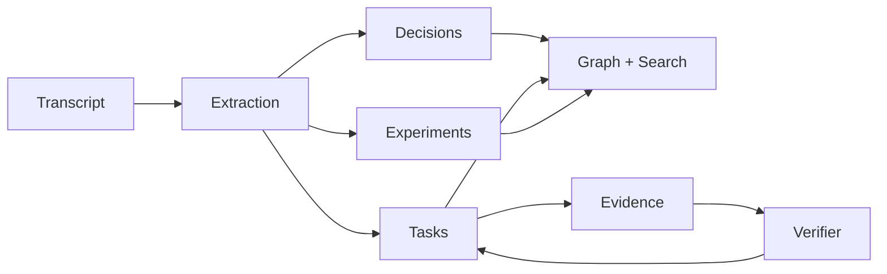

# LabFlow

> Meeting → execution OS for research and technical teams.

Welcome to the LabFlow documentation. If you're new, start with
[Onboarding](onboarding.md). For a deeper look under the hood,
read the [Architecture overview](architecture.md) and the
[ADRs](adr/index.md).

## What's new

* **v0.11** — **Wiki / knowledge base** with backlinks and immutable
  revision history, **smart entity links** (`#task-N`, `[[Page]]`,
  `@handle`), **GraphQL mutations**, **watchers + activity feed**, and
  a hand-written **TypeScript SDK** (`@labflow/sdk`).
* **v0.10** — **Tamper-evident audit chain** (SHA-256 hash chain over
  `audit_events` + `/api/audit/verify`), **signed backup & restore**,
  **automation rules engine** (declarative when/then JSON),
  **forecasting** (sprint ETA + per-task ETA), **customisable
  dashboards** with widget catalogue.
* **v0.9** — AI Copilot, plugin marketplace, vector index v2,
  read-replica routing, time-travel, PWA, i18n.
* **v0.8** — Workflow state machines, sprints, share links.
* **v0.7** — Bidirectional **WebSocket** at `/ws`, read-only **GraphQL**
  at `/graphql`, **OpenTelemetry** auto-instrumentation, **PostgreSQL
  full-text search**, distributed **worker leader-lock** for HA, official
  **Python SDK** (`labflow_client`), and a **Helm chart** for Kubernetes.
* **v0.6** — Threaded **comments** + emoji **reactions**, **saved
  searches**, **analytics** endpoint, **iCalendar** feed, **AI summary**,
  **HTML email digest**, per-user notification prefs.
* **v0.5** — RBAC, encryption at rest, SSE live updates, plugin loader,
  GDPR export/erase.
* **v0.4** — Hybrid keyword + semantic search, decision graph,
  rate limiting, idempotency, Slack notifier.

See the [changelog](changelog.md) for the full history.

## Five-minute tour

1. Paste a transcript or upload a file at `/app`.
2. LabFlow extracts decisions, tasks, experiments, assumptions, and
   blockers, attributing owners and deadlines from natural language
   like ``@alice will retrain the model by Friday``.
3. Search the resulting graph with hybrid lexical + semantic ranking
   and explainable per-result `score_components`.
4. Attach commits, PRs, or files to action items as **evidence**.
   The verifier scores the match; tasks close themselves when the
   evidence threshold is met.
5. Subscribe to webhooks (or a Slack URL) to fan events out to your
   chat, CI, or workflow tooling — and connect to `/api/stream` for a
   live SSE feed in your dashboard.
