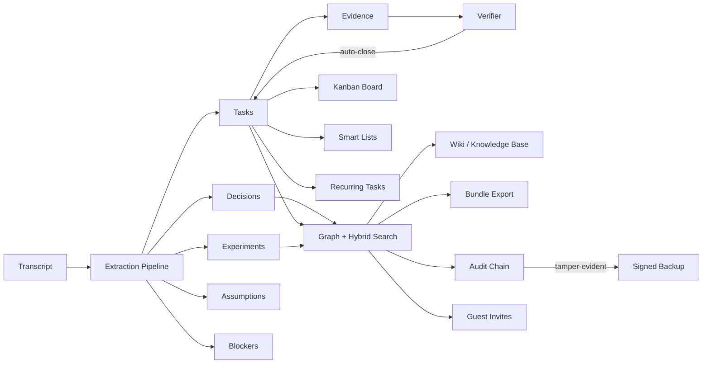

# LabFlow

<p align="center">
  <strong>Turn your team's meetings into shipped work.</strong><br/>
  <em>The open-source meeting-to-execution operating system.</em>
</p>

<p align="center">
  <a href="https://github.com/mariam-oss-eng/labflow"></a>
  <a href="#"></a>
  <a href="#"></a>
  <a href="#"></a>
  <a href="#"></a>
</p>

> Paste a transcript. Get a queryable graph of decisions, tasks,
> experiments, and evidence. Stream them onto a Kanban board, share
> them through scoped invites, export them as Markdown, ship them.

---

## Why LabFlow?

You already write notes after every standup. They're a graveyard. LabFlow
turns that text into **structured execution data**: who decided what,
who owns each follow-up, which experiments are running, what evidence
closes them, and where you're behind your sprint forecast.

| | Notion / Confluence | Jira / Linear | LabFlow |
|---|:---:|:---:|:---:|
| Free-form notes | ✅ | ⚠️ | ✅ |
| Tasks with owners & SLAs | ⚠️ | ✅ | ✅ |
| **Auto-extracted from transcripts** | ❌ | ❌ | **✅** |
| **Evidence-linked task closure** | ❌ | ❌ | **✅** |
| **Tamper-evident audit chain** | ❌ | ⚠️ | **✅** |
| **Queryable decision graph** | ❌ | ❌ | **✅** |
| **Sprint burndown forecasting** | ❌ | ✅ | **✅** |
| **Federated guest invites with scoped ACLs** | ⚠️ | ⚠️ | **✅** |
| Self-hosted, MIT-licensed, no telemetry | ❌ | ❌ | **✅** |

---

## Get started in 60 seconds

```bash
pip install -e .
labflow migrate
labflow serve  # → http://127.0.0.1:8000
```

Then open `http://127.0.0.1:8000/app` and paste a transcript:

```
Standup, May 8 2026.
We agreed to ship v1 by end of quarter.
@alice will write the design doc by Friday.
@bob will deploy the staging environment by Monday.
We need to evaluate the new vector index — assigning to @cathy.
```

LabFlow will extract:

* 1 **decision** ("ship v1 by end of quarter")
* 3 **tasks** (with owners, due dates, and confidence scores)
* 1 **experiment** ("evaluate the new vector index")

Open the **Kanban board** at `/app/board/_default`, the **REPL** with
`labflow repl`, or browse the GraphQL playground at `/graphql`.

---

## What's new in v0.13

* 🤝 **Federated guest invites** with scoped ACLs (`/api/invites`) — share a
  single task or wiki page with an outside reviewer, expiring tokens, no
  team membership required.
* 📜 **Markdown bundle export** (`/api/admin/export/bundle.zip`) — one `.md`
  per meeting/decision/task/wiki + a JSONL audit log + a manifest.
* 🔎 **Smart lists** — saved declarative task filters (`{state, assignee,
  label, due_before, sprint}`) addressable by slug.
* 💻 **Interactive CLI REPL** — `labflow repl` opens a shell against your
  team's data: `tasks`, `meetings`, `task 42 done`, `decisions`, `ingest`.

## What's new in v0.12

* 📋 **Kanban board** — `/api/board/{workflow}` JSON + `/app/board/{workflow}`
  HTML page, columns driven by your workflow's state machine.
* 🔁 **Recurring tasks** — daily/weekly/monthly templates that
  materialise into tasks via the existing job queue.
* 🚦 **Per-API-key daily quotas** with `429` enforcement and an admin
  dashboard at `/api/admin/quotas`.
* 🧮 **Bulk task operations** — atomic `POST /api/tasks/bulk` for
  transition/assign/priority/status changes (all audited).
* 🕘 **Per-key digest scheduling** — pick the UTC hour you want your
  daily/weekly digest delivered.

(See the [full changelog](changelog.md) for v0.4 → v0.13.)

---

## Architecture at a glance



Every action — task transitions, wiki edits, automation-rule firings,
invite acceptance — appends to the SHA-256 hash-chained audit log
(`/api/audit/verify`). Backups are detached-signature signed so an
attacker who steals your dump can't silently tamper with it.

---

## Five-minute tour

1. **Paste** a transcript at `/app` or `POST /api/meetings`.
2. **Extract** decisions, tasks, experiments, assumptions, and
   blockers — owners and deadlines come from natural-language patterns
   like `@alice will retrain the model by Friday`.
3. **Search** the resulting graph with hybrid lexical + semantic
   ranking and explainable per-result `score_components`.
4. **Attach** commits, PRs, or files to action items as **evidence**.
   The verifier scores the match; tasks close themselves when the
   evidence threshold is met.
5. **Plan** with the **Kanban board** (v0.12), saved **smart lists**
   (v0.13), and **sprint forecasting** (v0.10).
6. **Share** with **scoped guest invites** (v0.13), webhooks, the SSE
   live feed at `/api/stream`, or the official Python and TypeScript
   SDKs.
7. **Export** everything as a self-contained Markdown **bundle**
   (v0.13) — one file per entity plus a tamper-evidence audit log.

---

## Where to next?

* [Onboarding](onboarding.md) — set up your first team and key.
* [Architecture overview](architecture.md) — how the pieces fit.
* [Boards & smart lists](boards.md) — the v0.12 / v0.13 planning surface.
* [Recurring tasks & quotas](recurring_and_quotas.md) — schedules and limits.
* [Federation & invites](invites_and_bundle.md) — guest sharing + Markdown export.
* [Interactive REPL](repl.md) — drive LabFlow from your terminal.
* [API reference](api.md) — every route, grouped by tag.
* [GraphQL](graphql.md) — schema and example queries / mutations.
* [Architecture decisions (ADRs)](adr/index.md) — why we built it this way.
